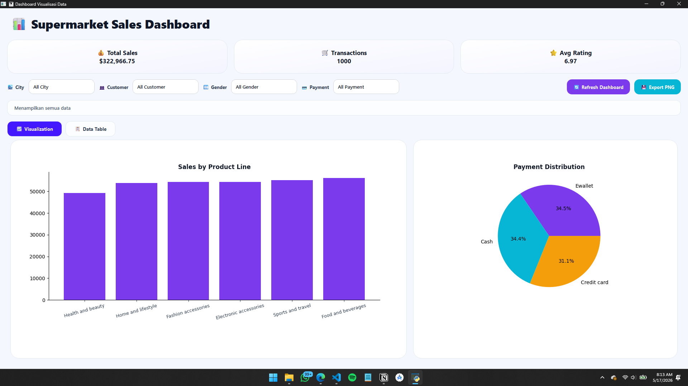
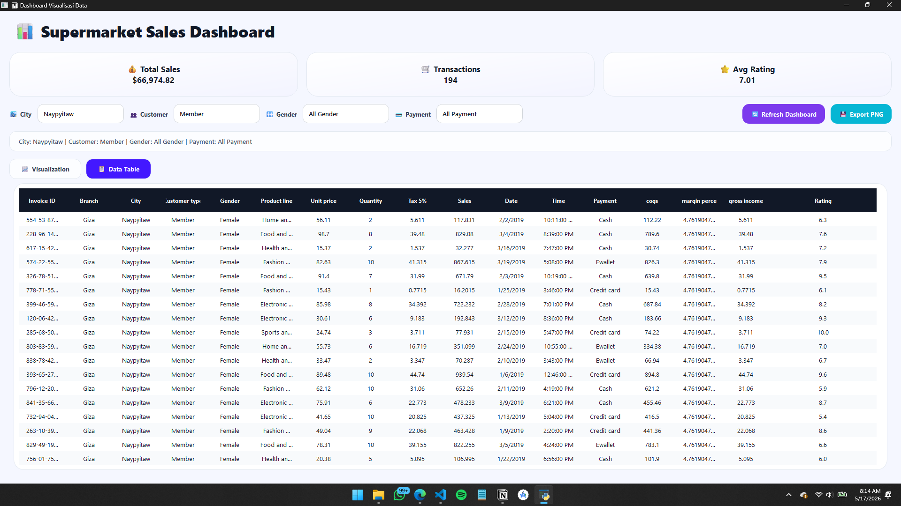
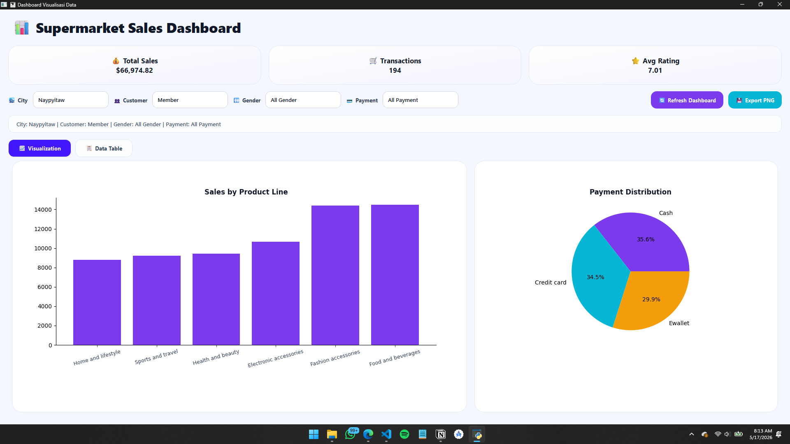
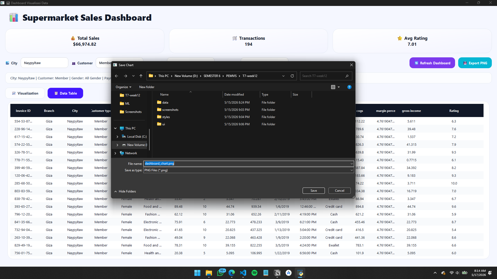

# 📊 Supermarket Sales Dashboard

Dashboard visualisasi data berbasis **PySide6** dan **Matplotlib** untuk menampilkan analisis penjualan supermarket menggunakan dataset nyata dari Kaggle.

---

# 👨‍💻 Identitas Mahasiswa

- **Nama** : Dodi Wijaya  
- **NIM** : F1D02310047  
- **Kelas** : Pemrograman Visual

---

# 📌 Deskripsi Project

Project ini merupakan aplikasi dashboard desktop menggunakan **Python** dan **PySide6** yang menampilkan data penjualan supermarket dalam bentuk:

- tabel data
- dashboard KPI
- visualisasi chart
- filter interaktif

Aplikasi menggunakan dataset **Supermarket Sales Dataset** dari Kaggle sehingga data yang divisualisasikan lebih realistis dan variatif.

---

# 🎯 Tujuan Project

Tujuan dari project ini adalah:

- Mengimplementasikan GUI menggunakan PySide6
- Mengolah data menggunakan Pandas
- Menampilkan visualisasi data menggunakan Matplotlib
- Membuat dashboard interaktif dan responsif
- Menerapkan styling modern menggunakan QSS
- Menampilkan data dalam bentuk tabel dan chart

---

# 📂 Struktur Project

```text
T7-week12/
│
├── main.py
│
├── data/
│   └── supermarket_sales.csv
│
├── ui/
│   ├── main_window.py
│   └── chart_widget.py
│
├── styles/
│   └── style.qss
│
├── screenshots/
│   ├── dashboard.png
│   ├── table.png
│   └── filter.png
│
├── requirements.txt
│
└── README.md
```

---

# 📊 Dataset

Dataset yang digunakan:

🔗 https://www.kaggle.com/datasets/faresashraf1001/supermarket-sales

Dataset berisi transaksi penjualan supermarket dengan kolom seperti:

| Kolom | Keterangan |
|---|---|
| Invoice ID | ID transaksi |
| City | Kota cabang supermarket |
| Customer type | Jenis pelanggan |
| Gender | Jenis kelamin pelanggan |
| Product line | Kategori produk |
| Quantity | Jumlah produk |
| Sales | Total transaksi |
| Payment | Metode pembayaran |
| Rating | Rating pelanggan |

---

# ✨ Fitur Utama

## ✅ Dashboard KPI

Menampilkan:
- Total Sales
- Total Transactions
- Average Rating

---

## ✅ Data Table

Menampilkan seluruh data mentah menggunakan `QTableWidget`.

---

## ✅ Visualisasi Data

Menggunakan Matplotlib untuk menampilkan:

- Bar Chart
- Pie Chart

Chart langsung ditampilkan di dalam aplikasi PySide6.

---

## ✅ Filter Dashboard

Filter berdasarkan:
- City
- Customer Type
- Gender
- Payment

Dashboard akan diperbarui ketika tombol refresh ditekan.

---

## ✅ Export Chart PNG

Menyimpan kedua chart menjadi file PNG.

---

## ✅ Responsive UI

Tampilan tetap rapi saat window di-resize.

---

# 🛠️ Teknologi yang Digunakan

- Python
- PySide6
- Pandas
- Matplotlib
- QSS (Qt Style Sheet)

---

# ▶️ Cara Menjalankan Project

## 1. Clone Repository

```bash
git clone https://github.com/USERNAME/T7-week12.git
```

---

## 2. Masuk ke Folder Project

```bash
cd T7-week12
```

---

## 3. Install Dependency

```bash
pip install -r requirements.txt
```

---

## 4. Jalankan Program

```bash
python main.py
```

---

# 📸 Screenshot Aplikasi

## Dashboard Visualization



---

## Data Table



---

## Filter Dashboard



---

## Export PNG



---

# 📌 Hasil Project

Aplikasi berhasil:
- menampilkan data penjualan supermarket
- menampilkan dashboard interaktif
- menampilkan visualisasi data
- menerapkan filter data
- menampilkan tabel data
- mengekspor chart ke PNG
- membuat UI modern dan responsive

---

# 📄 License

Project ini dibuat untuk keperluan tugas mata kuliah Pemrograman Visual.